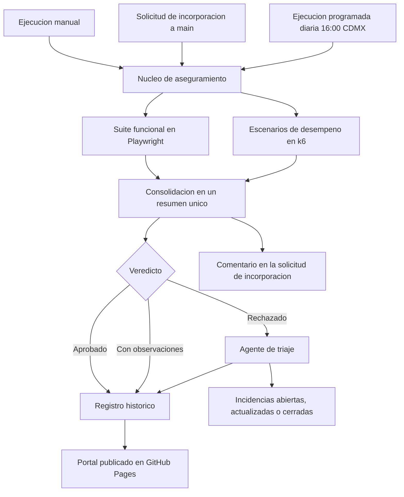

# Aseguramiento de calidad de los endpoints de busqueda

## Endpoints bajo prueba

Todas las pruebas de este repositorio se ejecutan contra **TheCatAPI, version 1**, en su entorno de
produccion. Estas son las dos direcciones exactas que se prueban:

```
https://api.thecatapi.com/v1/images/search
https://api.thecatapi.com/v1/breeds/search
```

| Endpoint | URL completa | Autenticacion | Parametros |
| --- | --- | --- | --- |
| Busqueda de imagenes | `GET https://api.thecatapi.com/v1/images/search` | Opcional. Cambia la respuesta | `size`, `mime_types`, `format`, `has_breeds`, `order`, `page`, `limit` |
| Busqueda de razas | `GET https://api.thecatapi.com/v1/breeds/search` | **Obligatoria.** Sin llave responde 403 | `q`, `attach_image` |

**URL base:** `https://api.thecatapi.com/v1`
**Autenticacion:** encabezado `x-api-key`. La especificacion tambien admite `?api_key=` en la URL. Configurable con la variable `URL_BASE_API` y el secreto `CAT_API_KEY`.
**Especificacion del proveedor:** https://developers.thecatapi.com/view-account/ylX4blBYT9FaoVd6OhvR?report=FJkYOq9tW

Comprobacion rapida desde tu terminal:

```bash
curl -i "https://api.thecatapi.com/v1/images/search?limit=1"
curl -i -H "x-api-key: DEMO-API-KEY" "https://api.thecatapi.com/v1/breeds/search?q=beng"
```

---

Este repositorio cubre el analisis del servicio, el plan de pruebas, el catalogo de casos con su
respuesta esperada, la evidencia real de cada caso, la suite funcional automatizada, los escenarios
de desempeno, el flujo de integracion continua y la publicacion del reporte historico.

**Portal publicado:** https://lrbg.github.io/TESTAPI/

---

## Indice

1. [El requerimiento](#1-el-requerimiento)
2. [Lo que se entrega](#2-lo-que-se-entrega)
3. [El flujo de aseguramiento](#3-el-flujo-de-aseguramiento)
4. [Formas de ejecucion](#4-formas-de-ejecucion)
5. [Cobertura](#5-cobertura)
6. [Casos de prueba con su respuesta](#6-casos-de-prueba-con-su-respuesta)
7. [Hallazgos](#7-hallazgos)
8. [Escenarios de desempeno](#8-escenarios-de-desempeno)
9. [El agente de triaje](#9-el-agente-de-triaje)
10. [Reporte historico](#10-reporte-historico)
11. [Puesta en marcha](#11-puesta-en-marcha)
12. [Estructura del repositorio](#12-estructura-del-repositorio)
13. [Marco normativo](#13-marco-normativo)

---

## 1. El requerimiento

Validar la calidad de dos endpoints de un servicio publico de consulta de imagenes y razas de
gatos, analizando la especificacion entregada y elaborando y ejecutando un plan de pruebas
funcional y tecnico.

| Recurso | Proposito declarado | Parametros contemplados |
| --- | --- | --- |
| `GET https://api.thecatapi.com/v1/images/search` | Buscar o devolver imagenes aleatorias | `size`, `mime_types`, `format`, `has_breeds`, `order`, `page`, `limit` |
| `GET https://api.thecatapi.com/v1/breeds/search` | Buscar razas por nombre | `q`, `attach_image` |

La especificacion anade que la busqueda de imagenes puede devolver los encabezados
`Pagination-Count`, `Pagination-Page` y `Pagination-Limit`, y que la busqueda de razas puede
devolver informacion de imagen asociada cuando `attach_image` vale 1.

### Observacion de partida

La especificacion entregada describe los dos endpoints y lista sus parametros. No define nada mas.
Esto es lo que falta:

| Falta | Consecuencia |
| --- | --- |
| Contrato de respuesta de `/breeds/search` | El segundo endpoint no tiene documentacion asociada |
| Codigos y forma del cuerpo de error | No hay resultado esperado para las pruebas negativas |
| Valores validos de `size`, `mime_types` y `format` | El enunciado los lista y la especificacion no los reconoce |
| Condicion de los encabezados de paginacion | El enunciado dice que "pueden" aparecer, sin precisar cuando |
| Efecto de `attach_image` | Mismo caso, y el comportamiento observado lo contradice |
| Limites de consumo por plan | No se puede dimensionar la prueba de carga |
| Acuerdo de nivel de servicio | Los umbrales de tiempo son una estimacion propia |

### El enunciado y la especificacion no coinciden

| Parametro | Lo declara la especificacion | Lo menciona el enunciado | Funciona |
| --- | --- | --- | --- |
| `limit` | Si, 1-100, por defecto 1 | Si | Si |
| `page` | Si, 0-n, por defecto 0 | Si | Si |
| `order` | Si, ASC/DESC/RAND | Si | Si |
| `has_breeds` | Si, 1 o 0 | Si | Si |
| `breed_ids` | Si | **No** | **Si** |
| `category_ids` | Si | **No** | No se observo efecto |
| `sub_id` | Si | **No** | No |
| `size` | **No** | Si | No |
| `mime_types` | **No** | Si | No |
| `format` | **No** | Si | No |

Siguiendo solo el enunciado se disenan casos sobre funcionalidad que no existe y se deja sin cubrir
`breed_ids`, el unico filtro del endpoint que funciona correctamente.

El comportamiento real se reconstruyo ejecutando mas de 170 peticiones contra el servicio.
El resultado son 17 desviaciones comprobadas, 5 de severidad alta.

El recurso de razas **exige credencial**: sin ella responde 403 a cualquier consulta. El enunciado no
lo menciona, pero la especificacion enlazada si lo indica de forma expresa. Quien se quede en el
enunciado concluye que el segundo ejercicio es inejecutable; quien abre el enlace encuentra la
instruccion. La suite cubre los dos modos, anonimo y autenticado, porque la diferencia entre ambos
resulto ser la fuente de varios hallazgos.

---

## 2. Lo que se entrega

| Entregable solicitado | Donde esta |
| --- | --- |
| Analisis del API | [Portal, seccion de analisis](https://lrbg.github.io/TESTAPI/analisis.html) y `docs/analisis.html` |
| Plan de pruebas | [Portal, plan de pruebas](https://lrbg.github.io/TESTAPI/plan.html) y `docs/plan.html` |
| Casos de prueba | [Catalogo navegable](https://lrbg.github.io/TESTAPI/casos.html) y `docs/datos/catalogo.json` |
| Evidencia de cada caso | [Evidencia por caso](https://lrbg.github.io/TESTAPI/evidencia.html) y `docs/datos/evidencias.json` |
| Priorizacion de pruebas | Seccion de priorizacion dentro del catalogo de casos |
| Propuesta de automatizacion | Seccion de automatizacion dentro del catalogo, materializada en este repositorio |
| Documento unico consolidado | `entregables/` en formato Word y PDF |

---

## 3. El flujo de aseguramiento



El ciclo va del disparo de la ejecucion a la publicacion del resultado y al seguimiento de los
defectos encontrados, sin intervencion manual en ningun punto intermedio.

1. **Disparo.** Tres vias independientes descritas en la seccion siguiente.
2. **Ejecucion funcional.** Playwright cubre los escenarios funcionales, negativos, de borde, de
   contrato, de seguridad de superficie y las verificaciones no funcionales de una sola peticion.
   Cada caso adjunta al reporte la peticion realizada, el codigo de estado, los encabezados
   relevantes, el tiempo de respuesta y la respuesta obtenida.
3. **Ejecucion de desempeno.** k6 mide el comportamiento temporal y la capacidad. El escenario de
   humo actua como puerta de entrada: si el servicio no responde bajo carga minima, seguir midiendo
   no aporta informacion.
4. **Consolidacion.** Los reportes de ambas herramientas se normalizan en un unico resumen, del que
   se derivan el veredicto, el registro historico y el triaje. Concentrar la normalizacion en un
   solo lugar evita que cada consumidor interprete los reportes crudos a su manera.
5. **Triaje.** El agente abre una incidencia por cada fallo nuevo con su evidencia y sus pasos de
   reproduccion, acumula las reapariciones sobre la incidencia existente y cierra por si mismo
   aquellas cuyo caso ha vuelto a pasar.
6. **Publicacion.** El resultado se incorpora al registro historico y el portal se vuelve a publicar
   con las cifras actualizadas y el reporte navegable de la ultima ejecucion.

### Veredicto

| Veredicto | Cuando se emite | Efecto |
| --- | --- | --- |
| Aprobado | Sin casos fallidos, sin umbrales incumplidos y sin desviaciones registradas | La ejecucion termina en verde |
| Con observaciones | Sin fallos, pero con desviaciones documentadas o casos inestables | La ejecucion termina en verde y las desviaciones quedan visibles |
| Rechazado | Hay casos funcionales fallidos o umbrales de desempeno incumplidos | La ejecucion termina en rojo y el triaje abre incidencias |

---

## 4. Formas de ejecucion

### 4.1 Manual

Desde la pestana de acciones, flujo **Ejecucion manual**. Permite elegir el conjunto de pruebas y el
escenario de desempeno.

| Parametro | Valores | Valor por defecto |
| --- | --- | --- |
| `suite` | completa, funcional, humo, contrato, seguridad, desempeno | completa |
| `escenario_desempeno` | humo, carga, estres, pico, resistencia | humo |
| `publicar_portal` | si, no | si |
| `ejecutar_triaje` | si, no | no |
| `actualizar_historico` | si, no | si |

Es la via prevista para los escenarios de carga elevada, que no forman parte de la ejecucion
programada y requieren autorizacion del proveedor del servicio.

### 4.2 Automatica ante una solicitud de incorporacion

Flujo **Verificacion de solicitud de incorporacion**. Se dispara sobre toda solicitud dirigida a
`main` al abrirla, al actualizarla, al reabrirla y al sacarla de borrador. Ejecuta la suite
funcional completa mas el escenario de humo de desempeno, y publica el resultado como comentario en
la propia solicitud.

No publica el portal ni abre incidencias: un fallo introducido en una rama en revision no debe
contaminar el registro historico ni el tablero de incidencias del producto. La informacion se
entrega donde se toma la decision, que es la solicitud misma.

Una revision nueva sobre la misma solicitud cancela la verificacion anterior, porque solo interesa
el resultado del ultimo estado propuesto.

### 4.3 Programada

Flujo **Ejecucion programada**, todos los dias de la semana a las **16:00 hora de la Ciudad de
Mexico**, expresado como `cron: '0 22 * * *'`.

GitHub interpreta toda expresion de calendario en tiempo universal coordinado. Mexico dejo de
aplicar horario de verano en 2022, de modo que la Ciudad de Mexico permanece todo el ano en UTC
menos seis horas y las 16:00 locales equivalen de forma estable a las 22:00 UTC, sin necesidad de
ajustar la expresion dos veces al ano.

El planificador de GitHub no garantiza el minuto exacto y puede retrasar una ejecucion en periodos
de alta demanda. Para una verificacion diaria ese margen es irrelevante.

Esta es la unica via que alimenta el registro historico y el tablero de incidencias, de modo que la
serie temporal se construya siempre en las mismas condiciones y sea comparable consigo misma.

### 4.4 En local

```bash
npm ci
npm test                  # suite completa
npm run test:humo         # solo los casos criticos
npm run test:contrato     # solo validacion de contrato
npm run test:seguridad    # solo seguridad de superficie
npm run reporte           # abre el reporte navegable

k6 run performance/humo.js
k6 run performance/carga.js

npm run consolidar        # normaliza los resultados
npm run sitio             # ensambla el portal en ./sitio
npm run triaje -- --simulacion   # muestra que haria el triaje sin escribir nada
```

---

## 5. Cobertura

Organizada segun el modelo de calidad de ISO/IEC 25010:2023. Las caracteristicas no cubiertas se
declaran de forma explicita: un plan que no dice lo que deja fuera no es un plan.

| Caracteristica | Subcaracteristica | Como se verifica | Estado |
| --- | --- | --- | --- |
| Adecuacion funcional | Completitud, correccion, pertinencia | Escenarios funcionales sobre ambos recursos y todos sus parametros | Cubierta |
| Eficiencia de desempeno | Comportamiento temporal, capacidad | Verificaciones de tiempo en la suite funcional y escenarios de k6 | Cubierta |
| Compatibilidad | Interoperabilidad | Validacion de contrato por esquema y politica de origen cruzado | Cubierta |
| Fiabilidad | Madurez, disponibilidad, tolerancia a fallos | Series sostenidas de peticiones y escenario de resistencia | Cubierta |
| Seguridad | Confidencialidad, integridad | Control de acceso, entradas hostiles, fuga de informacion | Parcial |
| Usabilidad | Proteccion frente a errores del usuario | Calidad y utilidad de los mensajes de error | Parcial |
| Mantenibilidad | Modularidad, capacidad de prueba | No se dispone del codigo del servicio | Fuera de alcance |
| Portabilidad | Instalabilidad, reemplazabilidad | Servicio gestionado por un tercero | Fuera de alcance |
| Flexibilidad | Escalabilidad | No verificable sin autorizacion para cargas elevadas | Fuera de alcance |

### Cobertura por tipo de prueba

| Tipo | Casos | Que verifica |
| --- | --- | --- |
| Funcional | 24 | El comportamiento declarado con entradas validas |
| Negativo | 15 | El rechazo uniforme y accionable de lo invalido |
| De borde | 16 | Los valores frontera de cada rango y las zonas sin especificacion |
| De contrato | 13 | La forma de la respuesta, en sus dos variantes segun autenticacion |
| De seguridad | 12 | Control de acceso, entradas hostiles y fuga de informacion |
| No funcional | 8 | Tiempo de respuesta, compresion, cache, origen cruzado, disponibilidad |
| **Total** | **87** | Ejecutables en aproximadamente cinco minutos |

Los 87 tienen evidencia real capturada: peticion, respuesta y resultado.

### Cobertura de parametros

| Parametro | Valido | Frontera | Invalido | Omitido | Tipo incorrecto |
| --- | --- | --- | --- | --- | --- |
| `limit` | si | si | si | si | si |
| `page` | si | si | si | si | no aplica |
| `order` | si | no aplica | si | si | no aplica |
| `has_breeds` | si | no aplica | si | si | no aplica |
| `size` | si | no aplica | si | si | no aplica |
| `mime_types` | si | no aplica | si | si | no aplica |
| `format` | si | no aplica | si | si | no aplica |
| `q` | si | si | si | si | no aplica |
| `attach_image` | si | no aplica | si | si | no aplica |
| `breed_ids` | si | no aplica | si | si | no aplica |
| `category_ids` | si | no aplica | no aplica | si | no aplica |
| `sub_id` | si | no aplica | no aplica | si | no aplica |

---

## 6. Casos de prueba con su respuesta

El catalogo completo, con los ocho campos que exige el entregable, esta en
[`docs/datos/catalogo.json`](docs/datos/catalogo.json) y se consulta de forma navegable y filtrable
en el [portal](https://lrbg.github.io/TESTAPI/casos.html).

La respuesta esperada de cada caso esta tomada del comportamiento real observado, no de una
suposicion: incluye codigos, mensajes y valores concretos. Estos son cuatro ejemplos
representativos.

<details>
<summary><b>IMG-N-01</b> &nbsp; Un tamano de coleccion igual a cero se rechaza con mensaje explicito</summary>

| Campo | Contenido |
| --- | --- |
| Endpoint | `GET /images/search` |
| Objetivo | Verificar que un valor por debajo del minimo se rechaza con un mensaje accionable |
| Entrada | `limit=0` |
| Prioridad | Alta |
| Tipo | Negativo |
| Riesgo que mitiga | RF-06 |

**Respuesta esperada**

```json
{
  "statusCode": 400,
  "timestamp": "2026-09-12T20:29:04.015Z",
  "path": "/v1/images/search?limit=0",
  "message": ["limit must not be less than 1"],
  "error": "Bad Request"
}
```

**Validaciones:** codigo 400, campo `error` igual a `Bad Request`, el mensaje declara la regla
incumplida, el cuerpo cumple el esquema comun de error.
</details>

<details>
<summary><b>IMG-B-03</b> &nbsp; La coleccion se trunca en silencio para el consumidor sin credencial</summary>

| Campo | Contenido |
| --- | --- |
| Endpoint | `GET /images/search` |
| Objetivo | Comprobar si el consumidor anonimo recibe la coleccion completa y si el recorte se comunica |
| Entrada | `limit=50`, ejecutado sin credencial y con credencial |
| Prioridad | Alta |
| Tipo | Borde |
| Riesgo que mitiga | RF-06 |

**Respuesta esperada**

Sin credencial: codigo 200 con **diez** elementos y ningun encabezado que informe el recorte.
Con credencial: codigo 200 con **cincuenta** elementos.

```
Sin credencial  ->  200, 10 elementos, campos: id, url, width, height
Con credencial  ->  200, 50 elementos, campos: id, url, width, height,
                    created_at, breeds, categories, colours, tags
```

**Validaciones:** cardinalidad anonima igual a 10, cardinalidad autenticada igual a 50, ausencia de
encabezado de truncamiento. Desviacion registrada como hallazgo H-02.
</details>

<details>
<summary><b>SEG-01</b> &nbsp; El recurso de razas exige credencial</summary>

| Campo | Contenido |
| --- | --- |
| Endpoint | `GET /breeds/search` |
| Objetivo | Verificar que el recurso protegido no atiende a un consumidor sin credencial |
| Entrada | `q=beng`, sin encabezado `x-api-key` |
| Prioridad | Alta |
| Tipo | Seguridad |
| Riesgo que mitiga | RT-06 |

**Respuesta esperada**

```json
{
  "statusCode": 403,
  "timestamp": "2026-09-12T20:29:05.541Z",
  "path": "/v1/breeds/search?q=beng",
  "message": "Authentication required. Please provide a valid API key.",
  "error": "Forbidden"
}
```

**Validaciones:** codigo 403, campo `error` igual a `Forbidden`, mensaje que indica la necesidad de
credencial, ausencia de acceso a los datos.
</details>

<details>
<summary><b>IMG-F-10</b> &nbsp; Los encabezados de paginacion acompanan al orden determinista</summary>

| Campo | Contenido |
| --- | --- |
| Endpoint | `GET /images/search` |
| Objetivo | Verificar la presencia y la coherencia de los encabezados de paginacion |
| Entrada | `order=DESC&limit=5&page=0`, con credencial |
| Prioridad | Alta |
| Tipo | Funcional |
| Riesgo que mitiga | RF-02 |

**Respuesta esperada**

```
HTTP 200
Pagination-Count: 13492
Pagination-Page: 0
Pagination-Limit: 5
Content-Type: application/json; charset=utf-8

[ 5 elementos ]
```

**Validaciones:** los tres encabezados presentes, total mayor que cero, pagina igual a la
solicitada, tamano igual al limite solicitado.
</details>

---

## 7. Hallazgos

Diferencias comprobadas entre lo que la especificacion declara y lo que el servicio hace. El detalle
completo, con su evidencia y su consecuencia, esta en el
[analisis publicado](https://lrbg.github.io/TESTAPI/analisis.html).

| Clave | Severidad | Hallazgo | Caso |
| --- | --- | --- | --- |
| H-01 | Alta | `attach_image` no tiene ningun efecto: las respuestas con 0 y con 1 son identicas byte a byte, y ambas incluyen el objeto `image` | `BRD-N-06` |
| H-03 | Alta | `mime_types` no restringe los resultados: `png` devuelve imagenes `.jpg`. La especificacion no declara el parametro | `IMG-B-07` |
| H-09 | Alta | El contrato de respuesta cambia segun la credencial: cuatro campos en modo anonimo, hasta diez en modo autenticado | `CTR-03` |
| H-13 | Alta | El filtro `sub_id`, declarado en la especificacion, no se aplica: ninguna de las diez imagenes devueltas lo tiene | `ESP-04` |
| H-16 | Alta | El objeto raza tiene dos formas distintas segun venga dentro de una imagen o de la busqueda de razas | `ESP-09` |
| H-17 | Alta | El enunciado y la especificacion no listan los mismos parametros | `ESP-10` |
| H-02 | Media | El recorte a diez sin credencial esta documentado, pero `limit=101` devuelve un 400 que afirma que el maximo es 100, y ningun encabezado informa del recorte | `IMG-B-03` |
| H-04 | Media | La validacion de parametros no es uniforme: `order` valida, `size` y `format` no | `IMG-B-06` |
| H-14 | Media | El filtro `category_ids` no devuelve imagenes con categoria | `ESP-05` |
| H-15 | Media | La especificacion declara `RAND` y el mensaje de error del servicio enumera `RANDOM` | `ESP-06` |
| H-05 | Media | `format=src` no altera la representacion y sigue devolviendo JSON | `IMG-B-10` |
| H-06 | Media | Los encabezados de paginacion solo aparecen con credencial y orden determinista, condicion no documentada | `IMG-B-11` |
| H-08 | Media | Omitir `q` devuelve un listado; enviarlo vacio devuelve 400 | `BRD-F-10` |
| H-10 | Media | El campo `message` del error es un arreglo en los 400 y una cadena en los 403 y 404 | `CTR-07` |
| H-12 | Media | Hay direcciones de imagen con la extension literal `.false` en lugar de su formato real | `IMG-F-02` |
| H-11 | Baja | La llave se acepta en la cadena de consulta. Es comportamiento documentado, se deja como observacion de seguridad | `SEG-04` |
| H-07 | Baja | Un verbo no soportado responde 404 en lugar de 405 con encabezado `Allow` | `IMG-N-07` |

### Como conviven los hallazgos con una suite en verde

Cuando el comportamiento observado difiere del declarado y el defecto ya esta documentado, el caso
afirma el comportamiento **real** y registra la desviacion como anotacion del reporte. La suite
permanece asi utilizable como red de regresion y el defecto sigue visible en el reporte, en el
portal y en el resumen de la ejecucion.

El dia en que el proveedor lo corrija, el caso fallara y obligara a revisar el hallazgo. Es
exactamente lo que debe ocurrir: un cambio de comportamiento, aunque sea una mejora, no debe pasar
inadvertido.

---

## 8. Escenarios de desempeno

| Escenario | Perfil | Duracion | Proposito | Ejecucion |
| --- | --- | --- | --- | --- |
| `humo` | 1 usuario virtual constante | 1 min | Confirmar que el servicio responde bajo carga minima antes de invertir tiempo en medir | Automatica |
| `carga` | Rampa a 10 usuarios, meseta de 3 min | 5 min | Caracterizar el comportamiento bajo el volumen habitual y verificar el acuerdo de nivel de servicio | Automatica diaria |
| `estres` | Escalones hasta 40 usuarios | 9 min | Localizar el punto en que deja de sostener el acuerdo y observar como se degrada | Manual, con autorizacion |
| `pico` | Subida brusca a 40 usuarios y regreso | 5 min | Verificar la recuperacion tras un aumento subito de demanda | Manual, con autorizacion |
| `resistencia` | 5 usuarios constantes | 30 min | Detectar fugas de memoria, agotamiento de conexiones o acumulacion de cuotas | Manual, con autorizacion |

### Umbrales de aceptacion

```
http_req_failed                 rate < 0.01
http_req_duration               p(95) < 1500 ms,  p(99) < 3000 ms
errores_de_negocio              rate < 0.01
duracion_busqueda_imagenes      p(95) < 1500 ms
duracion_busqueda_razas         p(95) < 1500 ms
```

Los valores se derivan de la linea base medida durante el analisis: mediana de 169 ms y percentil 95
de 514 ms en condiciones de uso individual. El margen sobre esa linea absorbe la variabilidad de la
red publica sin dejar de detectar una degradacion real. En cuanto el proveedor publique su acuerdo
de nivel de servicio, estos valores deben sustituirse por los comprometidos.

### Consideracion previa

El sistema bajo prueba es un servicio de terceros en produccion y no existe un entorno dedicado.
Toda peticion consume su cuota real. Los perfiles estan pensados para caracterizar el
comportamiento tal como lo percibe un consumidor, no para agotar la capacidad del servicio.
**Cualquier ejecucion por encima del perfil de carga nominal requiere autorizacion expresa del
proveedor.** Por eso los escenarios de estres, pico y resistencia existen en el repositorio pero
estan excluidos de la ejecucion programada.

Las respuestas de limitacion por cuota, con codigo 429 o 403, se contabilizan en una metrica propia
y no se suman a la tasa de fallo: no son un defecto del servicio sino una senal de que el perfil
excede lo que la credencial en uso tiene permitido.

---

## 9. El agente de triaje

Interpreta el resumen de la ejecucion y mantiene sincronizado el tablero de incidencias.

| Situacion | Accion |
| --- | --- |
| Fallo nuevo | Abre una incidencia con evidencia, clasificacion y pasos de reproduccion |
| Fallo que ya tiene incidencia abierta | Anade un comentario con la reaparicion y el nuevo mensaje de error, sin duplicar |
| Caso que vuelve a pasar | Comenta el cierre y cierra la incidencia por si mismo |
| Umbral de desempeno incumplido | Abre una incidencia con la tabla de mediciones del escenario |

El criterio de identidad es una huella estable derivada del identificador del caso, incrustada como
comentario oculto en el cuerpo de la incidencia. Gracias a ella un fallo intermitente no genera una
incidencia por ejecucion, sino una sola con su historial de reapariciones.

### Clasificacion de severidad

La severidad se deriva de la naturaleza del caso, no de quien lo reporta.

| Condicion | Severidad | Area | Justificacion |
| --- | --- | --- | --- |
| El caso esta etiquetado como de seguridad | Alta | seguridad | Afecta el control de acceso o el tratamiento de entradas hostiles |
| Critico y de contrato | Alta | contrato | Rompe el contrato y afecta a todos los consumidores a la vez |
| Critico | Alta | funcional | Compromete una capacidad esencial del servicio |
| De contrato | Media | contrato | Desviacion en un escenario no critico |
| No funcional | Media | desempeno | Degradacion de un atributo no funcional |
| De borde | Baja | borde | Comportamiento en una condicion frontera |

Las incidencias abiertas por el agente llevan siempre la etiqueta `deteccion-automatica`, mas una de
severidad y una de area. Los comentarios y las etiquetas anadidas a mano se conservan: el agente
nunca sobrescribe el trabajo de una persona.

---

## 10. Reporte historico

Cada ejecucion programada deja su huella en la rama `resultados`, separada de `main` para que la
acumulacion de mediciones no contamine el historial de cambios del codigo ni dispare ejecuciones
nuevas. El registro conserva hasta 180 ejecuciones, alrededor de seis meses de corridas diarias.

El [portal](https://lrbg.github.io/TESTAPI/historico.html) presenta:

- Resultados por ejecucion en barras apiladas de casos aprobados, fallidos y omitidos.
- Evolucion del percentil 95 de cada escenario de desempeno. Se usa el percentil 95 y no el promedio
  porque el promedio esconde justamente lo que interesa detectar: la cola lenta que sufre una
  minoria de los consumidores.
- Comparacion del percentil 95 actual con la media de las diez ejecuciones anteriores, que es lo que
  convierte un numero suelto en una tendencia.
- Tabla de las sesenta ejecuciones mas recientes con su veredicto, sus casos fallidos y el enlace a
  su bitacora completa.

Una reejecucion del mismo identificador sustituye a la anterior en lugar de duplicarla, de modo que
reintentar una corrida no distorsione las series.

---

## 11. Puesta en marcha

### 11.1 Requisitos

- Node.js 20 o superior
- k6, solo para ejecutar los escenarios de desempeno en local

### 11.2 Instalacion

```bash
git clone https://github.com/lrbg/TESTAPI.git
cd TESTAPI
npm ci
npm test
```

### 11.3 Credencial del servicio

El recurso de razas exige credencial. La suite resuelve la llave en tiempo de ejecucion desde el
secreto `CAT_API_KEY` y, en su ausencia, emplea la credencial publica de demostracion del proveedor,
cuyo uso esta previsto para ese fin. Ninguna credencial se almacena en el repositorio.

Para usar una credencial propia:

```bash
# en local
export CAT_API_KEY="su-credencial"

# en el repositorio
# Settings > Secrets and variables > Actions > New repository secret
# Nombre: CAT_API_KEY
```

Se recomienda hacerlo. La credencial de demostracion comparte su cuota con todos sus usuarios, de
modo que sus limites son impredecibles y pueden producir fallos intermitentes ajenos al servicio.

### 11.4 Activar la publicacion del portal

En `Settings > Pages`, seleccionar **GitHub Actions** como origen. La primera publicacion ocurre en
la siguiente ejecucion programada, o de inmediato lanzando el flujo **Publicacion del portal**.

### 11.5 Variables de entorno admitidas

| Variable | Proposito | Valor por defecto |
| --- | --- | --- |
| `CAT_API_KEY` | Credencial del servicio | Credencial publica de demostracion |
| `URL_BASE_API` | Direccion base del API | `https://api.thecatapi.com/v1` |
| `UMBRAL_RESPUESTA_MS` | Tiempo maximo tolerado por respuesta | 3000 |
| `UMBRAL_OBJETIVO_MS` | Tiempo objetivo por respuesta | 1500 |
| `USUARIOS_VIRTUALES` | Concurrencia de los escenarios de k6 | Segun escenario |
| `DURACION` | Duracion del escenario de resistencia | 30m |

---

## 12. Estructura del repositorio

```
.
├── .github/
│   ├── ISSUE_TEMPLATE/          Formularios de defecto y de riesgo
│   └── workflows/
│       ├── qa-core.yml                    Nucleo reutilizable del flujo
│       ├── ejecucion-manual.yml           Disparo a demanda
│       ├── solicitud-incorporacion.yml    Puerta de calidad de main
│       ├── ejecucion-programada.yml       Diaria a las 16:00 CDMX
│       └── publicar-portal.yml            Republicacion sin ejecutar pruebas
├── tests/api/
│   ├── soporte/
│   │   ├── entorno.ts           Configuracion, umbrales y datos de referencia
│   │   ├── cliente.ts           Cliente con medicion y captura de evidencia
│   │   └── esquemas.ts          Contratos de respuesta como esquemas JSON
│   ├── imagenes-funcional.spec.ts
│   ├── imagenes-negativo.spec.ts
│   ├── imagenes-borde.spec.ts
│   ├── razas-funcional.spec.ts
│   ├── razas-negativo.spec.ts
│   ├── contrato.spec.ts
│   ├── seguridad.spec.ts
│   └── no-funcional.spec.ts
├── performance/
│   ├── lib/comun.js             Metricas, umbrales y operaciones compartidas
│   ├── humo.js
│   ├── carga.js
│   ├── estres.js
│   ├── pico.js
│   └── resistencia.js
├── scripts/
│   ├── consolidar-resultados.mjs   Normaliza ambos reportes en un resumen unico
│   ├── actualizar-historico.mjs    Incorpora la ejecucion al registro
│   ├── generar-sitio.mjs           Ensambla el portal
│   └── triaje-issues.mjs           Agente de triaje de incidencias
├── docs/                        Origen del portal publicado
│   ├── index.html               Requerimiento, flujo y cobertura
│   ├── analisis.html            Analisis del API
│   ├── plan.html                Plan de pruebas
│   ├── casos.html               Catalogo, priorizacion y automatizacion
│   ├── evidencia.html           Peticion y respuesta real de cada caso
│   ├── historico.html           Reporte historico
│   └── datos/
│       ├── catalogo.json        Catalogo de casos con su respuesta esperada
│       ├── peticiones.json      Peticiones ejecutables de cada caso
│       └── evidencias.json      Evidencia capturada contra el servicio
├── entregables/                 Documento consolidado en Word y PDF
├── playwright.config.ts
└── package.json
```

---

## 13. Marco normativo

| Norma | Aporte al trabajo |
| --- | --- |
| ISO/IEC 25010:2023 | Modelo de calidad del producto. Ordena la cobertura por caracteristica y evita que la verificacion se reduzca a lo funcional. |
| ISO/IEC/IEEE 29119-1 y 29119-2 | Conceptos y proceso de prueba. Sustentan la estructura del plan y el ciclo de diseno, ejecucion y cierre. |
| ISO/IEC/IEEE 29119-3 | Documentacion de prueba. Define la forma del plan, de la especificacion de casos, de la bitacora de ejecucion, del reporte de incidencias y del informe de cierre. |
| ISO/IEC/IEEE 29119-4 | Tecnicas de prueba. Particion de equivalencia, analisis de valores frontera y prueba basada en riesgo aplicadas al diseno de los casos. |
| ISO/IEC 20000-1 | Gestion del servicio. Encuadra el acuerdo de nivel de servicio, la gestion de incidencias y el seguimiento continuo del desempeno. |

### Trazabilidad de los artefactos

| Artefacto de la norma | Donde vive en este repositorio |
| --- | --- |
| Test Plan | `docs/plan.html` |
| Test Case Specification | `docs/datos/catalogo.json` y los archivos `*.spec.ts` |
| Test Execution Evidence | `docs/datos/evidencias.json` y la pagina de evidencia del portal |
| Test Environment Requirements | `playwright.config.ts` y `tests/api/soporte/entorno.ts` |
| Test Execution Log | Evidencia adjunta a cada caso en el reporte navegable |
| Test Incident Report | Incidencias del repositorio y `.github/ISSUE_TEMPLATE/` |
| Test Completion Report | `resultados/resumen.json` y el reporte historico del portal |

---

## Licencia

MIT. Consulte el archivo [LICENSE](LICENSE).
