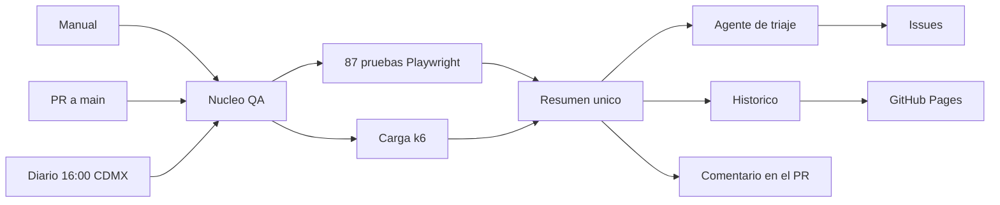

# Pruebas de los endpoints de búsqueda de TheCatAPI

87 pruebas automatizadas con evidencia real, escenarios de carga y un flujo que corre solo.

**Portal:** https://lrbg.github.io/TESTAPI/ · **Resumen en PDF:** [`entregables/Resumen-QA-API.pdf`](entregables/Resumen-QA-API.pdf)

---

## Endpoints probados

```
GET https://api.thecatapi.com/v1/images/search
GET https://api.thecatapi.com/v1/breeds/search
```

| | Detalle |
| --- | --- |
| URL base | `https://api.thecatapi.com/v1` |
| Autenticación | Encabezado `x-api-key`. El buscador de razas la exige: sin ella responde `403` |
| Entorno | Producción. No existe entorno de pruebas |
| Especificación | [Basics: Getting Images](https://developers.thecatapi.com/view-account/ylX4blBYT9FaoVd6OhvR?report=FJkYOq9tW) |

Comprobación rápida:

```bash
curl -i "https://api.thecatapi.com/v1/images/search?limit=1"
curl -i -H "x-api-key: DEMO-API-KEY" "https://api.thecatapi.com/v1/breeds/search?q=beng"
```

---

## Cómo ejecutar

```bash
npm ci
npm test                 # las 87 pruebas
npm run test:humo        # solo las críticas
npm run reporte          # abre el reporte con la evidencia
```

Escenarios de carga (requieren k6):

```bash
k6 run performance/humo.js      # 1 min
k6 run performance/carga.js     # 5 min
```

Con tu propia llave: `export CAT_API_KEY="tu-llave"`. Sin ella se usa la pública de demostración.

---

## Resultado

| | |
| --- | --- |
| Pruebas | 87 |
| Correctas | 69 |
| Con desviación documentada | 18 |
| Peticiones ejecutadas | 122 |
| Hallazgos | 17 |
| Tiempo mediano de respuesta | 204 ms |

### Los parámetros del primer endpoint

De los siete que lista el enunciado, **cuatro funcionan y tres no hacen nada**.

| Parámetro | Funciona | Qué pasa |
| --- | --- | --- |
| `limit` | Sí | Valida de 1 a 100. Sin llave entrega 10 como máximo |
| `page` | Sí | Pagina sin repetir imágenes. Rechaza negativos |
| `order` | Sí | Acepta ASC, DESC y RANDOM. Rechaza lo demás |
| `has_breeds` | Sí | Devuelve solo imágenes con raza |
| `size` | **No** | Acepta cualquier valor y lo ignora |
| `mime_types` | **No** | Se pide `png` y llegan `gif` y `jpg` |
| `format` | **No** | Los tres valores devuelven el mismo JSON |
| `breed_ids` | Sí | Lo declara la especificación, el enunciado no. **Es el único filtro que funciona** |
| `category_ids` | No | Lo declara la especificación, el enunciado no. No devuelve categorías |
| `sub_id` | No | Lo declara la especificación, el enunciado no. No filtra |

### Encabezados de paginación

El enunciado dice que "pueden" llegar. La condición real: **con llave y con orden fijo**.

```
?order=ASC&limit=3      → Pagination-Count 13492, Page 0, Limit 3
?order=DESC&limit=5     → Pagination-Count 13492, Page 0, Limit 5
?order=RANDOM&limit=5   → ninguno
sin llave               → ninguno
```

### Hallazgos

| Clave | Sev. | Qué pasa | Caso |
| --- | --- | --- | --- |
| H-17 | Alta | El enunciado y la especificación no listan los mismos parámetros | `ESP-10` |
| H-13 | Alta | El filtro `sub_id`, declarado, no se aplica | `ESP-04` |
| H-16 | Alta | La raza tiene dos formas distintas según de dónde venga | `ESP-09` |
| H-09 | Alta | La respuesta cambia según se use llave o no: 4 campos frente a 10 | `CTR-03` |
| H-03 | Alta | `mime_types` no filtra | `IMG-B-07` |
| H-01 | Alta | `attach_image` no hace nada | `BRD-N-06` |
| H-02 | Media | Sin llave llegan 10 aunque se pidan más, y el error dice que el máximo es 100 | `IMG-B-03` |
| H-04 | Media | Unos parámetros se validan y otros no | `IMG-B-06` |
| H-05 | Media | `format` no cambia lo que llega | `IMG-B-10` |
| H-06 | Media | Los datos de paginación solo llegan a veces | `IMG-B-11` |
| H-08 | Media | No mandar el término y mandarlo vacío dan resultados opuestos | `BRD-F-10` |
| H-10 | Media | El campo `message` cambia de tipo según el código | `CTR-07` |
| H-12 | Media | Hay imágenes con extensión `.false` | `IMG-F-02` |
| H-14 | Media | El filtro `category_ids` no trae imágenes con categoría | `ESP-05` |
| H-15 | Media | La especificación dice `RAND` y el error dice `RANDOM` | `ESP-06` |
| H-11 | Baja | La llave se acepta en la URL. Documentado, pero queda en registros | `SEG-04` |
| H-07 | Baja | Un método no permitido responde `404` en vez de `405` | `IMG-N-07` |

El detalle de cada uno, con evidencia, está en el [análisis publicado](https://lrbg.github.io/TESTAPI/analisis.html).

---

## Las 87 pruebas

| Grupo | Pruebas | Qué cubre |
| --- | --- | --- |
| `IMG-F` | 12 | Búsqueda de imágenes, camino principal |
| `IMG-N` | 10 | Entradas inválidas |
| `IMG-B` | 11 | Valores límite |
| `ESP` | 10 | Parámetros que declara la especificación |
| `BRD-F` | 10 | Búsqueda de razas, camino principal |
| `BRD-N` | 8 | Entradas inválidas y límites |
| `CTR` | 7 | Forma de la respuesta |
| `SEG` | 11 | Control de acceso y entradas hostiles |
| `NFN` | 8 | Tiempos, compresión, caché y disponibilidad |

Cada una con su petición, su respuesta y su veredicto en el [listado de evidencia](https://lrbg.github.io/TESTAPI/evidencia.html).

---

## El flujo



| Cómo se dispara | Qué ejecuta | Qué produce |
| --- | --- | --- |
| **Manual** — Actions → Ejecución manual | Lo que elijas | Publica el portal |
| **PR a `main`** — automático | Las 87 más el humo de carga | Comentario con el resultado en el PR |
| **Diario 16:00 CDMX** — `cron: 0 22 * * *` | Las 87 más humo y carga | Histórico, issues y portal |

México no aplica horario de verano, así que las 16:00 locales son siempre las 22:00 UTC.

### El agente de triaje

| Situación | Qué hace |
| --- | --- |
| Fallo nuevo | Abre un issue con evidencia, severidad y pasos |
| Fallo que ya tiene issue | Comenta la reaparición, sin duplicar |
| El caso vuelve a pasar | Comenta y cierra el issue |
| Umbral de carga incumplido | Abre un issue con las mediciones |

Lo que alguien escriba o etiquete a mano se conserva.

---

## Puesta en marcha

1. `Settings → Pages → Source: GitHub Actions`
2. `Settings → Secrets and variables → Actions` → `CAT_API_KEY` (opcional)
3. `Actions → Ejecución manual → Run workflow`

---

## Estructura

```
.github/workflows/    5 flujos: nucleo, manual, PR, diario y publicacion
tests/api/            9 archivos con las 87 pruebas
performance/          5 escenarios de k6
scripts/              consolidacion, historico, portal, triaje y documentos
docs/                 portal publicado
  datos/              catalogo, evidencias y hallazgos: fuente unica
entregables/          resumen y documento completo, en Word y PDF
```

Las pruebas, el portal y los documentos leen los mismos archivos de `docs/datos/`, así que no pueden contradecirse.

---

## Documentos

| Archivo | Qué es |
| --- | --- |
| [`Resumen-QA-API.pdf`](entregables/Resumen-QA-API.pdf) | **27 páginas.** Endpoint, listado de pruebas, petición, respuesta y evidencia |
| [`Evaluacion-tecnica-QA-API.pdf`](entregables/Evaluacion-tecnica-QA-API.pdf) | 97 páginas. Análisis completo, plan de pruebas, priorización y automatización |

---

## Licencia

MIT. Ver [LICENSE](LICENSE).
